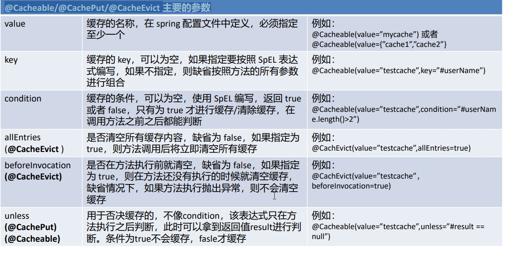
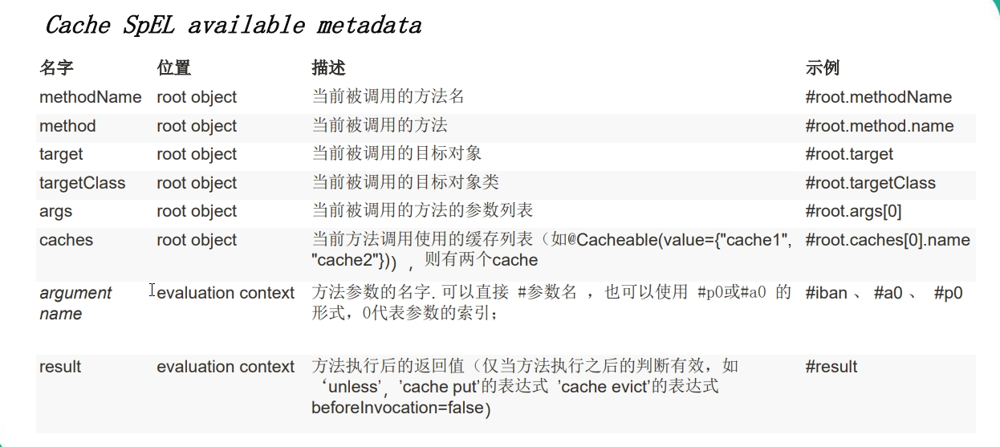

# 一、什么是缓存

 缓存就是数据交换的缓冲区（称作：Cache），他把一些外存上的数据保存在内存上，为什么保存在内存上，我们运行的所有程序里面的变量都是存放在内存中的，所以如果想将值放入内存上，可以通过变量的方式存储。在JAVA中一些缓存一般都是通过Map集合来实现的。

缓存在不同的场景下，作用是不一样的具体举例说明：
         ✔  操作系统磁盘缓存 ——> 减少磁盘机械操作。
         ✔  数据库缓存——>减少文件系统IO。
         ✔  应用程序缓存——>减少对数据库的查询。
         ✔  Web服务器缓存——>减少应用服务器请求。
         ✔  客户端浏览器缓存——>减少对网站的访问。

具体关于缓存的详细介绍以及缓存的面试问题可以参考这篇博客

# 三、几个重要概念&缓存注解

## 1、Cache：

缓存接口，定义缓存操作。实现有：RedisCache、EhCacheCache、ConcurrentMapCache等

## 2、CacheManager

缓存管理器，管理各种缓存（Cache）组件

## 3、@Cacheable

主要针对方法配置，能够根据方法的请求参数对其结果进行缓存

（后面会细说该注解）

## 4、@CacheEvict

清空缓存

## 5、@CachePut 

保证方法被调用，又希望结果被缓存。

## 6、@EnableCaching

开启基于注解的缓存

## 7、keyGenerator 

缓存数据时key生成策略

## 8、serialize 

缓存数据时value序列化策略

## 9、@Cacheable/@CachePut/@CacheEvict 主要的参数





# 四、springboot整合redis实现缓存

## 1、引入依赖

在pom.xml中引入spring-boot-starter-data-redis依赖

```xml
<dependency>
    <groupId>org.springframework.boot</groupId>
    <artifactId>spring-boot-starter-data-redis</artifactId>
</dependency>
```

## 2、配置redis连接地址

在application.yml或者application.properties中配置redis连接地址

这里还需要配置一下数据库的地址，方便测试使用

application.properties配置

```properties
spring.datasource.url=jdbc:mysql://MySQL的主机地址:3306/数据库名
spring.datasource.username=root
spring.datasource.password=密码
spring.datasource.driver-class-name=com.mysql.jdbc.Driver

# 启用mybatis的命名策略（即驼峰命名法）
mybatis.configuration.map-underscore-to-camel-case=true

logging.level.com.atguigu.cache.mapper=debug

debug=true

spring.redis.host=redis主机地址

```

application.yml配置：

```yml
spring:
  datasource:
    username: root
    password: 123456
    url: jdbc:mysql://MySQL的主机地址:3306/数据库名
    driver-class-name: com.mysql.jdbc.Driver
    type: com.alibaba.druid.pool.DruidDataSource #配置Druid数据源

    #   数据源其他配置
    initialSize: 5
    minIdle: 5
    maxActive: 20
    maxWait: 60000
    timeBetweenEvictionRunsMillis: 60000
    minEvictableIdleTimeMillis: 300000
    validationQuery: SELECT 1 FROM DUAL
    testWhileIdle: true
    testOnBorrow: false
    testOnReturn: false
    poolPreparedStatements: true
    #   配置监控统计拦截的filters，去掉后监控界面sql无法统计，'wall'用于防火墙
    filters: stat,wall,log4j
    maxPoolPreparedStatementPerConnectionSize: 20
    useGlobalDataSourceStat: true
    connectionProperties: druid.stat.mergeSql=true;druid.stat.slowSqlMillis=500
  redis:
    host: redis主机地址
#mybatis:
#  config-location: classpath:mybatis/mybatis-config.xml
# 开启驼峰命名
mybatis:
  configuration:
    map-underscore-to-camel-case: true
logging:
  level:
    com.canghe.springboot.mapper: debug
debug: true
#  mapper-locations: classpath:mybatis/mapper/*.xml
```

## 3、在虚拟机或者云服务器上安装redis

可以直接通过docker安装redis，并配置端口

## 4、使用RestTemplate操作redis

```java
    @Autowired
    StringRedisTemplate stringRedisTemplate;//操作k-v都是字符串

    @Autowired
    RedisTemplate redisTemplate;//操作k-v对象的
```

**Redis常见的五大数据类型**

String(字符串) 、list(列表)、set（集合）、hash（散列）、Zset（有序集合）

1. redisTemplate.opsForValue();//操作字符串
2. redisTemplate.opsForHash();//操作hash
3. redisTemplate.opsForList();//操作list
4. redisTemplate.opsForSet();//操作set
5. redisTemplate.opsForZSet();//操作有序set

测试代码：

```java
   @Test
    public void test01() {
//        stringRedisTemplate.opsForValue().append("key","helloword");
//        String msg = stringRedisTemplate.opsForValue().get("key");
//        System.out.println("msg:"+msg);
        stringRedisTemplate.opsForList().leftPush("firstList","1");
        stringRedisTemplate.opsForList().leftPush("firstList","2");
    }
```

# 五、@Cacheable注解

## 1、运行流程

1、方法运行之前，先去查询Cache（缓存组件），按照cacheNames指定的名字获取；（CacheManager先获取相应的缓存），第一次获取缓存如果没有Cache组件会自动创建。
2、去Cache中查找缓存的内容，使用一个key，默认就是方法的参数； key是按照某种策略生成的；默认是使用keyGenerator生成的，默认使用SimpleKeyGenerator生成key； SimpleKeyGenerator生成key的默认策略；
    		 如果没有参数；key=new SimpleKey()；
     		如果有一个参数：key=参数的值
     		如果有多个参数：key=new SimpleKey(params)；

3、没有查到缓存就调用目标方法； 

4、将目标方法返回的结果，放进缓存中

**@**Cacheable标注的方法执行之前先来检查缓存中有没有这个数据，默认按照参数的值作为key去查询缓存，**
   如果没有就运行方法并将结果放入缓存；以后再来调用就可以直接使用缓存中的数据；**

## 2、核心

 1）、使用CacheManager【ConcurrentMapCacheManager】按照名字得到Cache【ConcurrentMapCache】组件
  2）、key使用keyGenerator生成的，默认是SimpleKeyGenerator

## 3、几个属性

- cacheNames/value：指定缓存组件的名字;将方法的返回结果放在哪个缓存中，是数组的方式，可以指定多个缓存；

- key：缓存数据使用的key；可以用它来指定。默认是使用方法参数的值  1-方法的返回值， 编写SpEL； #i d;参数id的值   #a0  #p0  #root.args[0]    getEmp[2]

- keyGenerator：key的生成器；可以自己指定key的生成器的组件id，key/keyGenerator：二选一使用;

- cacheManager：指定缓存管理器；或者cacheResolver指定获取解析器

-  condition：指定符合条件的情况下才缓存； condition = "#a0>1"：第一个参数的值》1的时候才进行缓存

- unless:否定缓存；当unless指定的条件为true，方法的返回值就不会被缓存；可以获取到结果进行判断

  ```
  unless = "#result == null"
       *              unless = "#a0==2":如果第一个参数的值是2，结果不缓存；
  ```

-  sync：是否使用异步模式

@Cacheable例子：

```java
 @Cacheable(value = {"emp"}/*,keyGenerator = "myKeyGenerator",condition = "#a0>1",unless = "#a0==2"*/)
    public Employee getEmp(Integer id){
        System.out.println("查询"+id+"号员工");
        Employee emp = employeeMapper.getEmpById(id);
        return emp;
    }
```

# 六、@CachePut

## 1、启用场景

既调用方法，又更新缓存数据；同步更新缓存，修改了数据库的某个数据，同时更新缓存；

## 2、运行时机

- 先调用目标方法
- 将目标方法的结果缓存起来

## 3、测试步骤

 1、查询1号员工；查到的结果会放在缓存中；
     key：1  value：lastName：张三
  2、以后查询还是之前的结果
  3、更新1号员工；【lastName:zhangsan；gender:0】
     将方法的返回值也放进缓存了；
     key：传入的employee对象  值：返回的employee对象；
  4、查询1号员工？
     应该是更新后的员工；
     key = "#employee.id":使用传入的参数的员工id；
     key = "#result.id"：使用返回后的id
      @Cacheable的key是不能用#result
      为什么是没更新前的？【1号员工没有在缓存中更新】

```java
 @CachePut(/*value = "emp",*/key = "#result.id")
    public Employee updateEmp(Employee employee){
        System.out.println("updateEmp:"+employee);
        employeeMapper.updateEmp(employee);
        return employee;
    }
```

# 七、@CacheEvict

## 缓存清除

```java
    /**
     * @CacheEvict：缓存清除
     *  key：指定要清除的数据
     *  allEntries = true：指定清除这个缓存中所有的数据
     *  beforeInvocation = false：缓存的清除是否在方法之前执行
     *      默认代表缓存清除操作是在方法执行之后执行;如果出现异常缓存就不会清除
     *
     *  beforeInvocation = true：
     *      代表清除缓存操作是在方法运行之前执行，无论方法是否出现异常，缓存都清除
     *
     *
     */
    @CacheEvict(value="emp",beforeInvocation = true/*key = "#id",*/)
    public void deleteEmp(Integer id){
        System.out.println("deleteEmp:"+id);
        //employeeMapper.deleteEmpById(id);
        int i = 10/0;
    }
```

# 八、@Caching