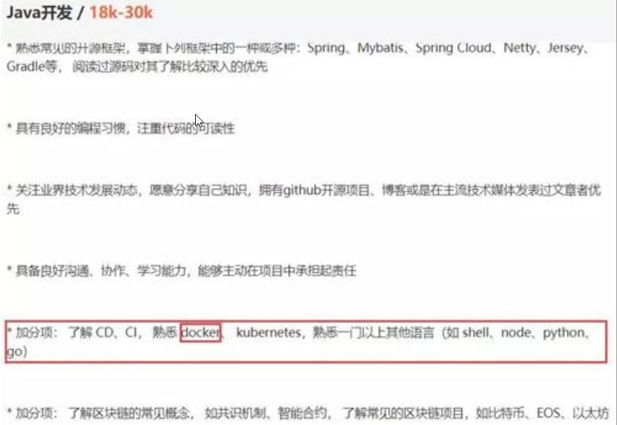
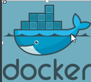

# 一、前言

在计算机技术日新月异的今天， Docker 在国内发展的如火如荼。特别是在一线互联网公司 Docker 的使用是十分普遍的，甚至成为了一些企业面试的加分项，不信的话看看下面这张图。



这是在某招聘网站上看到的招聘 Java 开发工程师的招聘要求，其中有一条熟悉 Docker 成为了你快速入职的加分项，由此可见熟悉 **Docker 在互联网公司的地位之重要**。

**Docker相关视频教程下载：**

http://www.jsdaima.com/video/490.html
http://www.jsdaima.com/video/459.html
http://www.jsdaima.com/video/384.html
http://www.jsdaima.com/video/371.html
http://www.jsdaima.com/video/363.html

# 二、Docker简介




## 1、概念

当把环境从一个服务器迁移到另一个服务器，当你新买了电脑，会遇上要重新安装一系列的软件，比如JDK、Tomcat、maven、redis等，而安装完之后每一次都需要再去配置环境，但是这些都是重复性的工作，有什么办法可以解决呢？

玩过云服务器的听说过有镜像一说，将所有的软件和需要的配置都打包好做成镜像，下次需要的时候只需要安装镜像就可以。

类似的，Docker就是解决这种问题的，将所有的软件程序都放在docker仓库中，我们只需要在电脑上下载docker即可，不需要再去进行繁琐的安装和配置了，只需要几个命令就可以将我们的环境搭建好，这就是docker。

总结：

**Docker**是一个开源的应用容器引擎；是一个轻量级容器技术；Docker支持将软件编译成一个镜像；然后在镜像中各种软件做好配置，将镜像发布出去，其他使用者可以直接使用这个镜像；运行中的这个镜像称为容器，容器启动是非常快速的。

## 2、Docker 的优势

- Docker 启动快速（比虚拟机快多了）
- Docker 需要的资源更少。Docker 在操作系统级别进行虚拟化，Docker 容器和内核交互，几乎没有性能损耗，性能优于通过 Hypervisor 层与内核层的虚拟化。
- Docker 更轻量。Docker 的架构可以共用一个内核与共享应用程序库，所占内存极小。同样的硬件环境，Docker 运行的镜像数远多于虚拟机数量，对系统的利用率非常高。
- 与虚拟机相比，Docker 隔离性更弱。Docker 属于进程之间的隔离，虚拟机可实现系统级别隔离。
- 安全性。Docker 的安全性也更弱，Docker 的租户 Root 和宿主机 Root 等同，一旦容器内的用户从普通用户权限提升为 Root 权限，它就直接具备了宿主机的 Root 权限，进而可进行无限制的操作
- 可管理性。Docker 的集中化管理工具还不算成熟。各种虚拟化技术都有成熟的管理工具，例如 VMware vCenter 提供完备的虚拟机管理能力。
- 高可用和可恢复性。Docker 对业务的高可用支持是通过快速重新部署实现的。
- 虚拟化具备负载均衡，高可用，容错，迁移和数据保护等经过生产实践检验的成熟保障机制， VMware 可承诺虚拟机 99.999% 高可用，保证业务连续性。
- 快速创建、删除。虚拟化创建是分钟级别的，Docker 容器创建是秒级别的，Docker 的快速迭代性，决定了无论是开发、测试、部署都可以节约大量时间

## 3、核心概念

docker主机(Host)：安装了Docker程序的机器（Docker直接安装在操作系统之上）；

docker客户端(Client)：连接docker主机进行操作；

docker仓库(Registry)：用来保存各种打包好的软件镜像；

docker镜像(Images)：软件打包好的镜像；放在docker仓库中；

docker容器(Container)：镜像启动后的实例称为一个容器；容器是独立运行的一个或一组应用


# 三、安装docker 

## 1、安装linux虚拟机

​	1）、VMWare、VirtualBox（安装）；

​	2）、导入虚拟机文件centos7-atguigu.ova；

​	3）、双击启动linux虚拟机;使用  root/ 123456登陆

​	4）、使用客户端连接linux服务器进行命令操作；

​	5）、设置虚拟机网络；

​		桥接网络===选好网卡====接入网线；

​	6）、设置好网络以后使用命令重启虚拟机的网络

```shell
service network restart
```

​	7）、查看linux的ip地址

```shell
ip addr
```

​	8）、使用客户端连接linux；

## 2、在linux虚拟机上安装docker

步骤：

```shell
1、检查内核版本，必须是3.10及以上
uname -r
2、安装依赖包
sudo yum install -y yum-utils device-mapper-persistent-data lvm2 
3、设置阿里云镜像源
sudo yum-config-manager --add-repo https://mirrors.aliyun.com/docker-ce/linux/centos/docker-ce.repo
2、安装docker
sudo yum install docker
3、输入y确认安装
4、启动docker
[root@localhost ~]# systemctl start docker
[root@localhost ~]# docker -v
Docker version 1.12.6, build 3e8e77d/1.12.6
5、开机启动docker
[root@localhost ~]# systemctl enable docker
Created symlink from /etc/systemd/system/multi-user.target.wants/docker.service to /usr/lib/systemd/system/docker.service.
6、停止docker
systemctl stop docker
```

# 四、Docker常用命令和操作


### 1）、镜像操作

| 操作 | 命令                                            | 说明                                                     |
| ---- | ----------------------------------------------- | -------------------------------------------------------- |
| 检索 | docker  search 关键字  eg：docker  search redis | 我们经常去docker  hub上检索镜像的详细信息，如镜像的TAG。 |
| 拉取 | docker pull 镜像名:tag                          | :tag是可选的，tag表示标签，多为软件的版本，默认是latest  |
| 列表 | docker images                                   | 查看所有本地镜像                                         |
| 删除 | docker rmi image-id                             | 删除指定的本地镜像                                       |

https://hub.docker.com/

### 2）、容器操作

软件镜像（QQ安装程序）----运行镜像----产生一个容器（正在运行的软件，运行的QQ）；

步骤：

```shell
1、搜索镜像
[root@localhost ~]# docker search tomcat
2、拉取镜像
[root@localhost ~]# docker pull tomcat
3、根据镜像启动容器
docker run --name mytomcat -d tomcat:latest
4、docker ps  
查看运行中的容器
5、 停止运行中的容器
docker stop  容器的id
6、查看所有的容器
docker ps -a
7、启动容器
docker start 容器id
8、删除一个容器
 docker rm 容器id
9、启动一个做了端口映射的tomcat
[root@localhost ~]# docker run -d -p 8888:8080 tomcat
-d：后台运行
-p: 将主机的端口映射到容器的一个端口    主机端口:容器内部的端口

10、为了演示简单关闭了linux的防火墙
service firewalld status ；查看防火墙状态
service firewalld stop：关闭防火墙
11、查看容器的日志
docker logs container-name/container-id

更多命令参看
https://docs.docker.com/engine/reference/commandline/docker/
可以参考每一个镜像的文档

```


### 3）、安装MySQL示例

```shell
docker pull mysql
```


错误的启动

```shell
[root@localhost ~]# docker run --name mysql01 -d mysql
42f09819908bb72dd99ae19e792e0a5d03c48638421fa64cce5f8ba0f40f5846

mysql退出了
[root@localhost ~]# docker ps -a
CONTAINER ID        IMAGE               COMMAND                  CREATED             STATUS                           PORTS               NAMES
42f09819908b        mysql               "docker-entrypoint.sh"   34 seconds ago      Exited (1) 33 seconds ago                            mysql01
538bde63e500        tomcat              "catalina.sh run"        About an hour ago   Exited (143) About an hour ago                       compassionate_
goldstine
c4f1ac60b3fc        tomcat              "catalina.sh run"        About an hour ago   Exited (143) About an hour ago                       lonely_fermi
81ec743a5271        tomcat              "catalina.sh run"        About an hour ago   Exited (143) About an hour ago                       sick_ramanujan


//错误日志
[root@localhost ~]# docker logs 42f09819908b
error: database is uninitialized and password option is not specified 
  You need to specify one of MYSQL_ROOT_PASSWORD, MYSQL_ALLOW_EMPTY_PASSWORD and MYSQL_RANDOM_ROOT_PASSWORD；这个三个参数必须指定一个
```

正确的启动

```shell
[root@localhost ~]# docker run --name mysql01 -e MYSQL_ROOT_PASSWORD=123456 -d mysql
b874c56bec49fb43024b3805ab51e9097da779f2f572c22c695305dedd684c5f
[root@localhost ~]# docker ps
CONTAINER ID        IMAGE               COMMAND                  CREATED             STATUS              PORTS               NAMES
b874c56bec49        mysql               "docker-entrypoint.sh"   4 seconds ago       Up 3 seconds        3306/tcp            mysql01
```

做了端口映射

```shell
[root@localhost ~]# docker run -p 3306:3306 --name mysql02 -e MYSQL_ROOT_PASSWORD=123456 -d mysql
ad10e4bc5c6a0f61cbad43898de71d366117d120e39db651844c0e73863b9434
[root@localhost ~]# docker ps
CONTAINER ID        IMAGE               COMMAND                  CREATED             STATUS              PORTS                    NAMES
ad10e4bc5c6a        mysql               "docker-entrypoint.sh"   4 seconds ago       Up 2 seconds        0.0.0.0:3306->3306/tcp   mysql02
```


几个其他的高级操作

```
docker run --name mysql03 -v /conf/mysql:/etc/mysql/conf.d -e MYSQL_ROOT_PASSWORD=my-secret-pw -d mysql:tag
把主机的/conf/mysql文件夹挂载到 mysqldocker容器的/etc/mysql/conf.d文件夹里面
改mysql的配置文件就只需要把mysql配置文件放在自定义的文件夹下（/conf/mysql）

docker run --name some-mysql -e MYSQL_ROOT_PASSWORD=my-secret-pw -d mysql:tag --character-set-server=utf8mb4 --collation-server=utf8mb4_unicode_ci
指定mysql的一些配置参数
```


